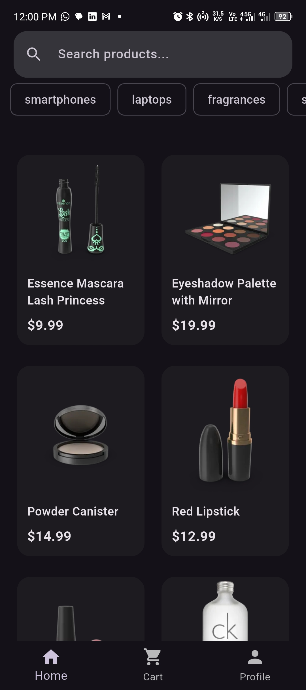
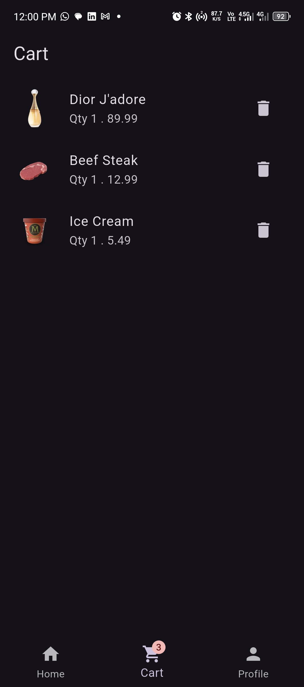
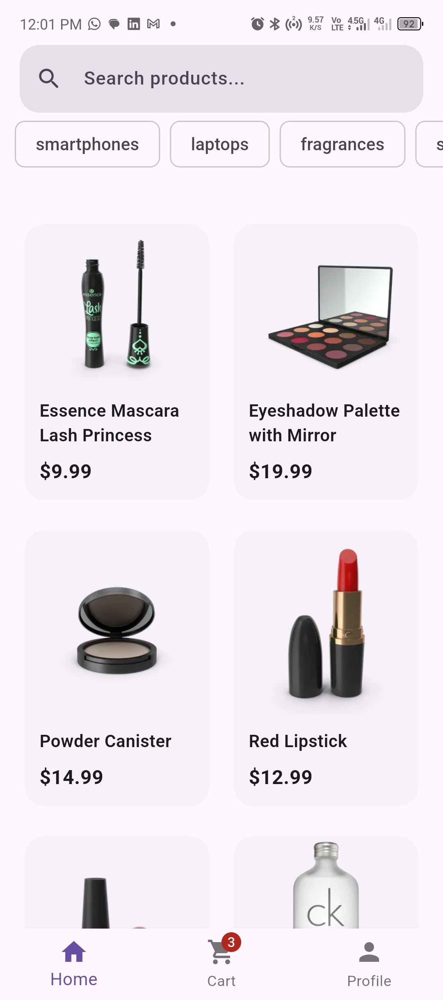

# E-Commerce Flutter App

A Flutter e-commerce browsing app built with Clean Architecture, Riverpod, and go_router — built as a portfolio project simulating real production app structure.

## Screenshots

| Product List | Product Detail | Cart | Dark Mode |
|---|---|---|---|
|  |  |  |  |

## Features
- [x] Clean Architecture (data/domain/presentation layers, feature-first)
- [x] Product listing with infinite scroll pagination
- [x] Debounced search
- [x] Category filtering
- [x] Product detail navigation via go_router path params
- [x] Shopping cart with persistent local storage (SharedPreferences)
- [x] Bottom navigation with StatefulShellRoute (preserved tab state)
- [x] Dark mode toggle
- [x] Centralized error handling (sealed Result/Failure pattern)
- [x] Empty and error states throughout

## Architecture

Feature-first Clean Architecture:
lib/
     core/
        network/ - Dio client, interceptors, timeout config
        errors/ - Failure and Result sealed classes
        router/ - go_router configuration (StatefulShellRoute)
        theme/ - Dark mode theme provider
     features/
        products/
                data/ - ProductModel (fromJson), repository implementation
                domain/ - Product entity, repository interface
                presentation/ - Screens, AsyncNotifierProvider (pagination, search, filter)
        cart/
                data/ - CartItemModel (fromJson/toJson for persistence)
                domain/ - CartItem entity
                presentation/ - Cart screen, AsyncNotifierProvider (persistent local storage)

**Key architectural decisions:**
- Domain entities have zero knowledge of JSON/data sources — models in the data layer handle serialization and extend domain entities (polymorphism)
- `Result<T>` sealed class forces compile-time handling of success/error states, replacing unchecked `throw`
- Both product and cart state use `AsyncNotifierProvider` — even cart's local SharedPreferences read is async, so `AsyncNotifier` avoids an empty-state flash on startup that a synchronous `Notifier` would cause

## Tech Stack
- **State Management:** Riverpod (AsyncNotifierProvider for both remote and local async state)
- **Networking:** Dio
- **Routing:** go_router (StatefulShellRoute for persistent bottom navigation)
- **Local Storage:** SharedPreferences
- **API:** [DummyJSON](https://dummyjson.com)

## Getting Started

```bash
flutter pub get
flutter run
```

## What I Learned Building This
This project was built to practice real production patterns: Clean Architecture layering, Dependency Inversion via repository interfaces, proper error handling with sealed classes instead of unchecked exceptions, and choosing the correct Riverpod provider type based on whether state involves asynchronous initialization — not just whether data comes from a network source.